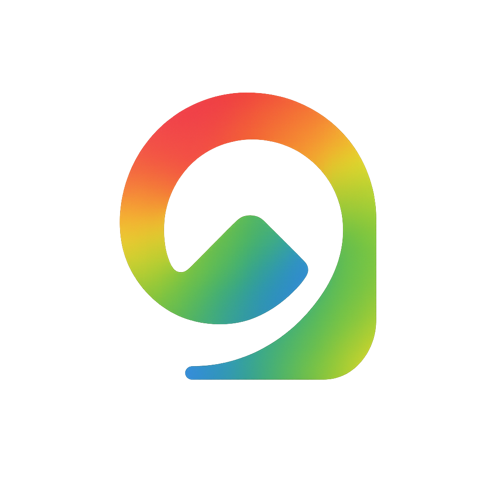
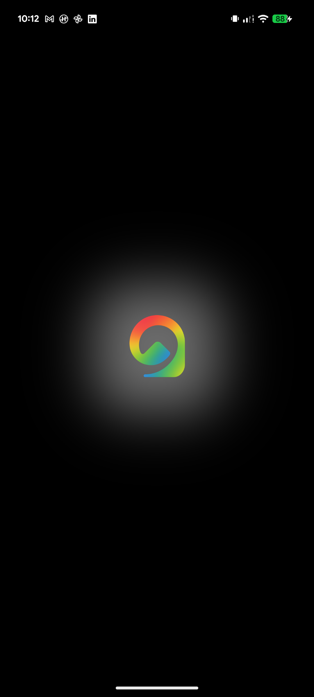
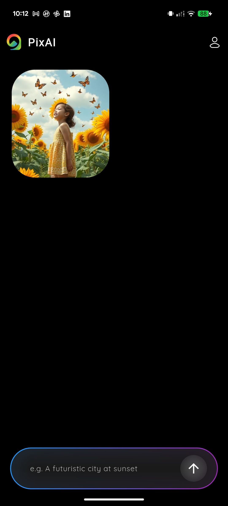
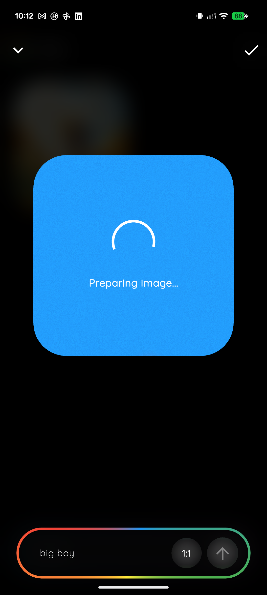
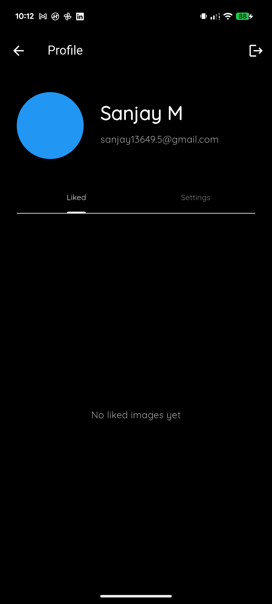

<p align="center">
  
</p>

<h1 align="center">PixAI</h1>
<p align="center">
  <b>Describe. Design. Delight.</b><br>
  <i>AI-powered image generation app built with Flutter.</i>
</p>

---

## ✨ Overview

PixAI is a next-generation Flutter application that lets you generate stunning images from text prompts using advanced AI models. Describe your imagination, and PixAI brings it to life instantly. All images are generated via the Pollinations API, with a beautiful, modern UI and seamless user experience.

---

## 🚀 Features

- 🔒 **Google Sign-In Authentication**
- 📝 **Prompt-to-Image Generation** (via Pollinations API)
- 🖼️ **Staggered Gallery View** with smooth animations
- ❤️ **Like & Save Images** locally
- ☁️ **Cloud Backup & Restore** (Firestore integration)
- 📱 **Responsive UI** (mobile-first, supports all screen sizes)
- 🌈 **Animated Gradients & Glassmorphism**
- 🧠 **Blocked Words Filtering** (safe for all users)
- 📤 **Share & Download Images**
- 🧩 **Profile Page** with liked images and settings
- 🔥 **Offline Support** for saved images
- 🛡️ **Account Protection** (auto-block on repeated adult content attempts)

---

## 📸 Screenshots

<p align="center">
  <br/>
  <!-- Screenshots grid -->
  <table>
    <tr>
      <td></td>
      <td></td>
      <td></td>
    </tr>
    <tr>
      <td></td>
      <td></td>
      <td></td>
    </tr>
    <tr>
      <td></td>
      <td></td>
      <td></td>
    </tr>
  </table>
</p>

---

## 🛠️ Tech Stack

- **Flutter** (Dart)
- **Firebase** (Auth, Firestore)
- **Pollinations API** (image & text)
- **State Management:** flutter_bloc
- **UI:** flutter_screenutil, mesh_gradient, auto_size_text, cached_network_image, skeletonizer
- **Persistence:** sqflite, shared_preferences
- **Other:** path_provider, permission_handler, share_plus

---

## ⚡ Getting Started

### 1. Prerequisites

- [Flutter SDK](https://flutter.dev/docs/get-started/install)
- [Firebase CLI](https://firebase.google.com/docs/cli)
- Android Studio / Xcode (for device emulation)

### 2. Clone the Repository

```bash
git clone https://github.com/yourusername/pixai.git
cd pixai
```

### 3. Install Dependencies

```bash
flutter pub get
```

### 4. Configure Firebase

- Add your `google-services.json` (Android) and/or `GoogleService-Info.plist` (iOS) to the respective directories.
- Update `lib/firebase_options.dart` if needed.

### 5. Run the App

```bash
flutter run
```

---

## 🧩 Folder Structure

```
lib/
  ├── bloc/                # State management (BLoC)
  ├── models/              # Data models
  ├── screens/             # UI screens
  ├── services/            # API, DB, Auth, Download services
  ├── widgets/             # Reusable widgets
  ├── firebase_options.dart
  └── main.dart
assets/
  └── images/              # App logo & sample images
```

---

## 📝 Usage

1. **Sign in** with Google.
2. **Enter a prompt** (in English) describing the image you want.
3. **Generate** and view your image in the gallery.
4. **Like**, **download**, or **share** your favorite images.
5. **Backup** your gallery to the cloud or **restore** it anytime.

---

## 🔒 Safety & Moderation

PixAI automatically blocks adult or inappropriate prompts using a comprehensive filter. Repeated violations will result in account blocking for user safety.

---

## 🤝 Contributing

Contributions are welcome! Please open issues or submit pull requests for improvements.

1. Fork the repo
2. Create your feature branch (`git checkout -b feature/YourFeature`)
3. Commit your changes (`git commit -am 'Add some feature'`)
4. Push to the branch (`git push origin feature/YourFeature`)
5. Open a Pull Request

---

## 📄 License

This project is licensed under the MIT License.

---

## 🙏 Acknowledgements

- [Pollinations API](https://pollinations.ai/)
- [Flutter Community](https://flutter.dev/community)
- [Firebase](https://firebase.google.com/)

---

<p align="center">
  
</p>
